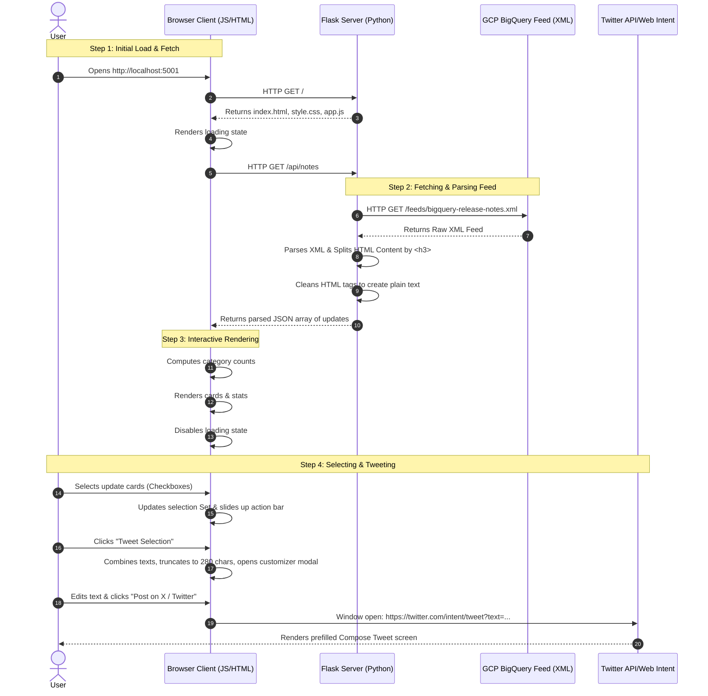

# Project Architecture & Request-Response Workflow

This document provides a detailed breakdown of the **BigQuery Release Notes Explorer & Share** application.

---

## 🎨 Main Features Overview

1.  **Atom Feed Parsing & Breakdown**: Instead of presenting a whole day's release notes as a single paragraph, the application splits the raw XML feed by `<h3>` tags to extract individual updates (e.g. distinct Features, Announcements, or Issues) to make them searchable and shareable.
2.  **Interactive Client Search & Filtering**: Offers real-time client-side search (over categories, text, and dates) and quick category filters without querying the server multiple times.
3.  **Multi-Selection Sharing**: Allows picking multiple cards to generate a unified summary.
4.  **Simulated Tweet Composer Modal**: Provides character counting (with color warnings near the 280-character limit) and X / Twitter Web Intent redirecting.

---

## ⚙️ Server-Side Architecture (Python Flask)

The backend is lightweight, single-process, and handles API requests and server-side scraping.

### Key File: [app.py](file:///Users/swarna/Desktop/agy-cli-projects/bq-releases-notes/app.py)

-   **Routing**:
    -   `GET /`: Serves the static [index.html](file:///Users/swarna/Desktop/agy-cli-projects/bq-releases-notes/templates/index.html) dashboard.
    -   `GET /api/notes`: Requests, parses, and returns the parsed release notes in JSON format.
-   **XML Parsing (`parse_feed`)**:
    -   Fetches the raw Atom feed using the `requests` library.
    -   Loads the feed into memory as an XML element tree via Python's built-in `xml.etree.ElementTree`.
    -   Identifies standard Atom namespaces (`{http://www.w3.org/2005/Atom}`) and iterates over `<entry>` elements.
-   **Granular Parser**:
    -   Extracts HTML inside `<content type="html">`.
    -   Uses Python regular expressions (`re.split(r'(<h3>.*?</h3>)', content_html)`) to separate headers from description paragraphs.
    -   Builds distinct update payloads for each parsed sub-section.
-   **Text Sanitizer (`clean_html_tags`)**:
    -   Strips `<p>`, `<a>`, and `<code>` HTML tags using regex to compile pure plain text (essential for tweet bodies).

---

## 💻 Client-Side Architecture (HTML, CSS, JS)

The client side is responsible for layout, aesthetics, dynamic states, and user interactions.

### 1. View & UI Design: [index.html](file:///Users/swarna/Desktop/agy-cli-projects/bq-releases-notes/templates/index.html) & [style.css](file:///Users/swarna/Desktop/agy-cli-projects/bq-releases-notes/static/css/style.css)
-   **Grid Layout**: Displays cards responsively.
-   **Glassmorphism**: Cards use a transparent backdrop (`rgba(20, 26, 42, 0.65)`) with a backdrop-blur filter to create a sleek interface.
-   **Inline SVGs**: Avoids external icon libraries, loading crisp vector graphics instantly.
-   **Glow Gradients**: Dynamic radial gradients positioned in the background create a premium feel.

### 2. State & Logic: [app.js](file:///Users/swarna/Desktop/agy-cli-projects/bq-releases-notes/static/js/app.js)
-   **Cache Store**: Stores parsed updates in a local array (`releaseNotes`). Search and category filters operate on this cache for instantaneous results.
-   **State Router**: Switches between classes (`loading`, `error`, `empty`, `grid`) to display appropriate views.
-   **Multi-Select Controller**: Manages a `Set` of selected update IDs. Selecting cards adds/removes IDs and triggers the slide-up transition of the bottom action bar.
-   **Tweet Intent Compiler**: Pre-formats tweet texts, regulates character limits, and routes payload to `https://twitter.com/intent/tweet?text=...`.

---

## 🔄 Request-Response Workflow

The diagram below details the end-to-end data flow when a user opens the page and interacts with it:



---

## 🔍 Detailed Walkthrough: Fetching & Tweeting an Update

1.  **Client Request**: When the DOM loads, `app.js` invokes `fetchReleaseNotes()`, making a fetch request to `/api/notes`.
2.  **Scraping & Clean up**: The Flask backend grabs the live XML feed from Google Cloud. It splits the entry content. For example:
    *   **Raw XML Input**:
        ```xml
        <entry>
          <title>June 17, 2026</title>
          <content type="html"><![CDATA[<h3>Feature</h3><p>You can enable autonomous embedding...</p>]]></content>
        </entry>
        ```
    *   **Split Output**:
        ```json
        {
          "date": "June 17, 2026",
          "type": "Feature",
          "content_html": "<p>You can enable autonomous embedding...</p>",
          "content_text": "You can enable autonomous embedding...",
          "link": "https://docs.cloud.google.com/...#June_17_2026"
        }
        ```
3.  **Client-side Caching**: The JSON is returned to the client. `app.js` updates category counters (e.g., `Features: 12`, `Issues: 2`) and populates the grid.
4.  **UI Interactions**: The user types a word (e.g. `"autonomous"`) in the search box. `app.js` runs a filter over the in-memory array and re-renders only matching cards instantly.
5.  **Compose & Share**: The user clicks the "Tweet" button on the card. The JS extracts the card's `content_text`, combines it with the link and hashtags, opens a custom modal showing exactly how many characters are used, and links it directly to Twitter's web composition engine.
